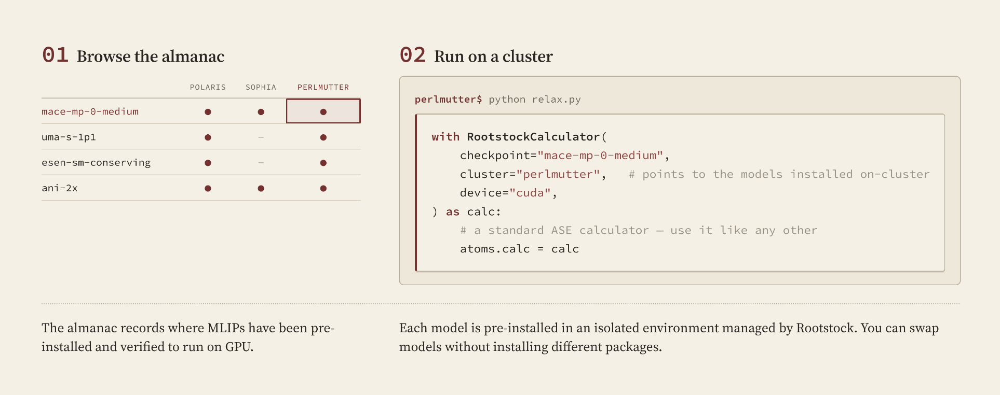
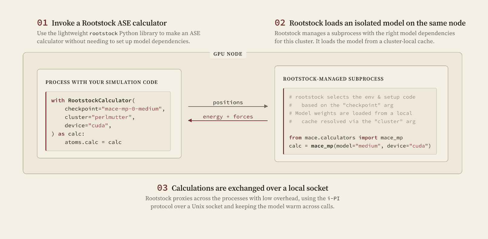
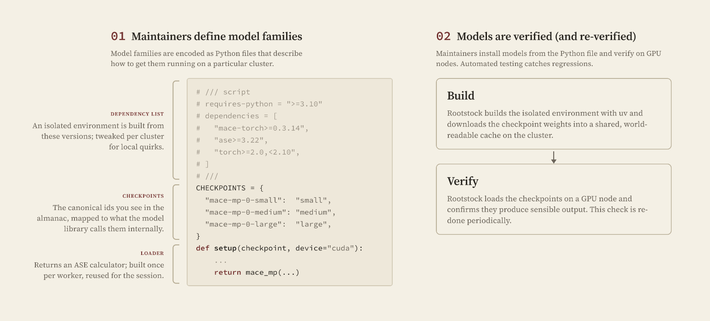

# Rootstock

Rootstock is a Python library that lets you run many machine-learned interatomic potentials (MLIPs) on an HPC cluster from a single [ASE](https://wiki.fysik.dtu.dk/ase/)-compatible calculator. Each MLIP family runs in its own pre-built, isolated Python environment that a maintainer has already installed and verified on the cluster, so you never resolve conflicting Python or library versions yourself. Swapping models is a one-line change to the `checkpoint` argument.

## How do I use Rootstock?

Browse the [Matter Model Almanac](https://garden-ai.github.io/almanac) to find a model that is installed and verified on your cluster, then point a `RootstockCalculator` at it. Each model is already installed in an isolated environment, so changing models does not change your own environment.

## How does Rootstock run a model?

You call the calculator from the lightweight `rootstock` library, which carries no model dependencies. Rootstock starts the model in a managed subprocess on the same GPU node, in the environment built for that cluster, loading weights from a cluster-local cache. Positions and forces are exchanged over a local Unix socket using the [i-PI protocol](https://ipi-code.org/). The model is loaded once and kept warm across calls.

## How does Rootstock add models?

Maintainers define each model family as a Python file: a [PEP 723](https://peps.python.org/pep-0723/) dependency list, a declaration of `CHECKPOINTS` in this family, and a `setup()` loader that returns an ASE calculator. They build the isolated environment and verify it on a GPU node. Automated testing re-verifies checkpoints periodically to catch regressions.

## How to run

-   :material-language-python:{ .lg .middle } **Run — with Python and ASE**

    ---

    The main path: install the package and call `RootstockCalculator` from an ASE script.

    [:octicons-arrow-right-24: Python and ASE](run-python.md)

-   :material-puzzle:{ .lg .middle } **Run — from other tools**

    ---

    Use a Rootstock-hosted model from any tool that accepts an ASE calculator.

    [:octicons-arrow-right-24: Other tools](run-tools.md)

-   :material-robot:{ .lg .middle } **Run — with agents**

    ---

    Let a coding agent discover what's deployed and drive Rootstock for you.

    [:octicons-arrow-right-24: Agents](run-agents.md)

-   :material-test-tube:{ .lg .middle } **Nightly Smoke-Testing**

    ---

    Keep a cluster's manifest current with automated nightly checks.

    [:octicons-arrow-right-24: Nightly Smoke-Testing](nightly-smoke-testing.md)

